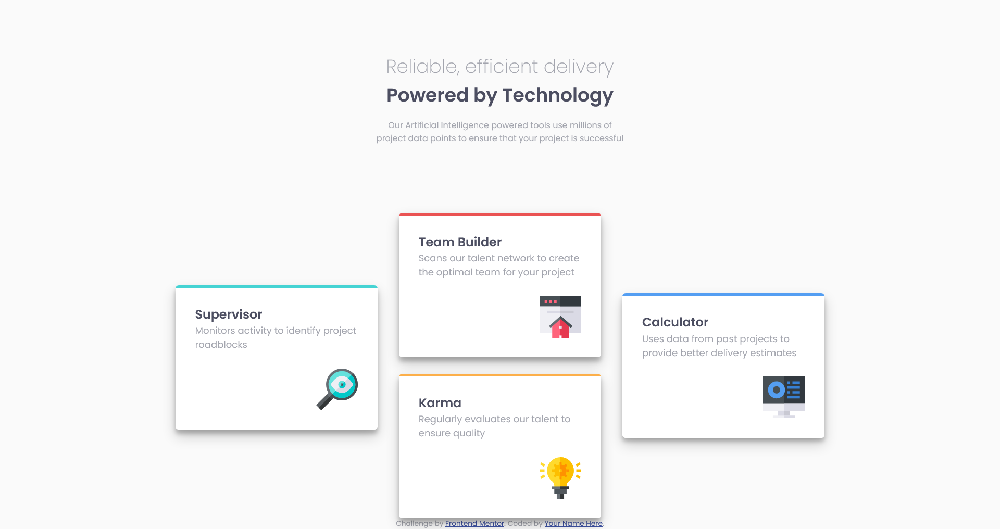
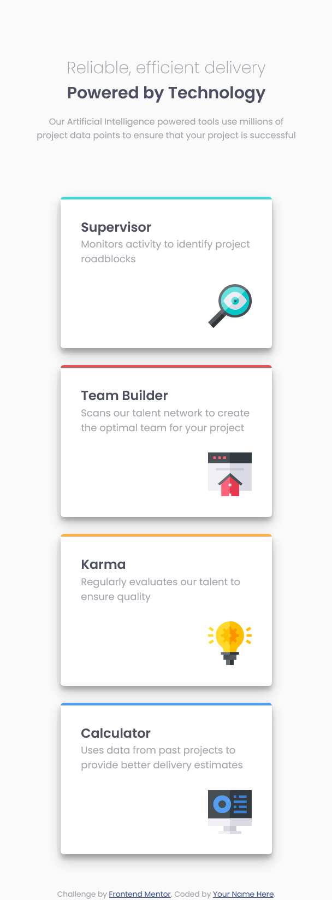

# Frontend Mentor - Four card feature section solution

This is a solution to the [Four card feature section challenge on Frontend Mentor](https://www.frontendmentor.io/challenges/four-card-feature-section-weK1eFYK). Frontend Mentor challenges help you improve your coding skills by building realistic projects.

- Visit Live Site URL [here](https://frontend-mentor-io.github.io/four-card-feature-section-master/)

## Table of contents

- [Overview](#overview)
  - [The challenge](#the-challenge)
  - [Screenshot](#screenshot)
  - [Links](#links)
- [My process](#my-process)
  - [Built with](#built-with)
  - [What I learned](#what-i-learned)
  - [Continued development](#continued-development)
  - [Useful resources](#useful-resources)
- [Author](#author)

## Overview

### The challenge

Users should be able to:

- View the optimal layout for the site depending on their device's screen size
- Implement a different layout for different screen sizes
- using CSS GRID layout for large screen

### Screenshot

#### Desktop screenshot

#### Mobile screenshot

### Links

- Solution URL: [Github Repo](https://github.com/frontend-mentor-io/four-card-feature-section-master)
- Live Site URL: [Github page](https://frontend-mentor-io.github.io/four-card-feature-section-master/)

## My process

### Built with

- Semantic HTML5 markup
- CSS custom properties
- CSS Grid

### What I learned

- I learn about the fundamentals of CSS GRID
- Adding template areas for grid wrapper
- Add template name for grid item

### Continued development

As I've seen the power of CSS GRID, I should I learn it more and use it for project
that has two dimensional layout

### Useful resources

- [CSS GRID Playground](https://grid.layoutit.com/) - This help me to determine what the grid layout should look like on my website rather than implementing it directly on the website itself.
- [CSS GRID Fundamentals](https://css-tricks.com/snippets/css/complete-guide-grid/) - This is an amazing article which helped me finally understand CSS GRID. I'd recommend it to anyone still learning this concept.

## Author

- Github - [Neomill](https://github.com/Neomill)
- Frontend Mentor - [@neomill](https://www.frontendmentor.io/profile/Neomill)
- Gmail - [Neomill Marc Reas](rneomillmarc@gmail.com)
